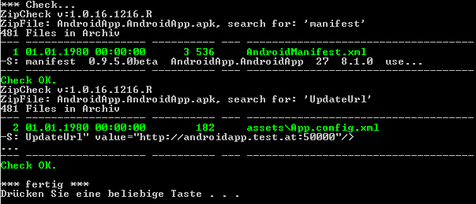

# ZipCheck

Command-Line-Tool: Search in .ZIP-Files (.apk, ...) for a Text in a File, for Batch and Automation (Azure-DevOps Pipeline)

    ZipCheck v:1.0.16.1216.R
    Error: no Parameter.
    ZipCheck C:\dir\x.zip y1.dll y2.dll -s:ver1 -sdl:100 -se:xor2

Sample:

    .\ZipCheck.exe AndroidApp.AndroidApp.apk AndroidManifest.xml   -s:manifest  -sdl:105
    .\ZipCheck.exe AndroidApp.AndroidApp.apk assets\app.config.xml -s:UpdateUrl -sdl:45

    ZipCheck v:1.0.16.1216.R
    ZipFile: AndroidApp.AndroidApp.apk, search for: 'manifest'
    481 Files in Archiv
    --- ------------------- ---------- --- ------------------------------------
      1 01.01.1980 00:00:00      3 536     AndroidManifest.xml
    -S: manifest  0.9.5.0beta  AndroidApp.AndroidApp  27  8.1.0  use...
    --- ------------------- ---------- --- ------------------------------------
    Check OK.
    ZipCheck v:1.0.16.1216.R
    ZipFile: AndroidApp.AndroidApp.apk, search for: 'UpdateUrl'
    481 Files in Archiv
    --- ------------------- ---------- --- ------------------------------------
      2 01.01.1980 00:00:00        182     assets\App.config.xml
    -S: UpdateUrl" value="http://androidapp.test.at:50000"/>
    ...
    --- ------------------- ---------- --- ------------------------------------
    Check OK.

